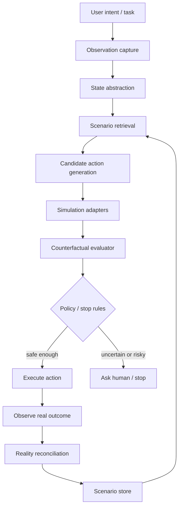
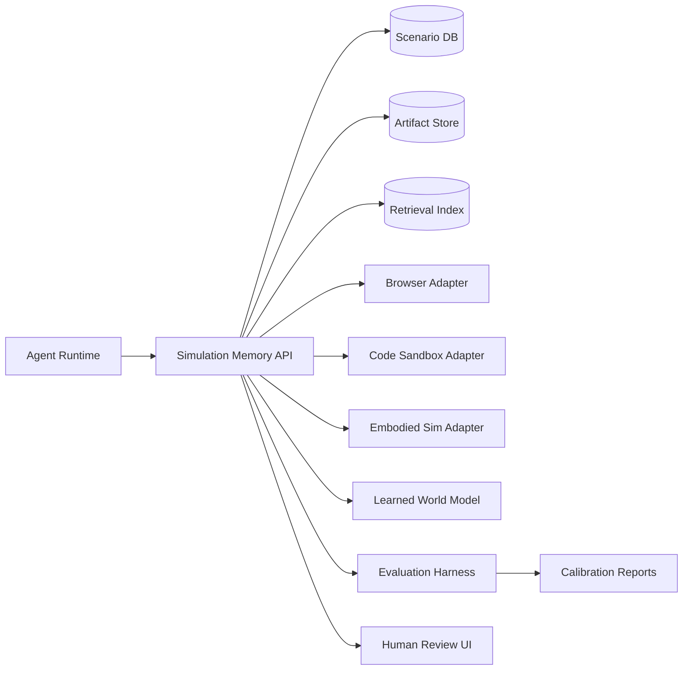

# Technical Architecture — Simulation Memory for Embodied Agents

## System components

1. **Capture layer**
   - Records observations, tool calls, UI state, environment metadata, screenshots, DOM/accessibility trees, filesystem diffs, simulator state, and user intent.

2. **State abstraction layer**
   - Converts raw traces into typed objects: actors, resources, affordances, constraints, permissions, goals, hazards, and reversible/irreversible actions.

3. **Scenario store**
   - Stores episodes as replayable records with state snapshots, action traces, outcomes, predicted outcomes, discrepancies, and tags.

4. **Retrieval engine**
   - Retrieves relevant past scenarios through structured filters and semantic search.

5. **Simulation adapter layer**
   - Routes a proposed action to the right simulator: symbolic model, browser replay, git/container sandbox, learned world model, robotics simulator, or high-fidelity domain simulator.

6. **Counterfactual evaluator**
   - Runs multiple candidate actions, scores outcome likelihood, reversibility, safety, uncertainty, and progress.

7. **Policy / stop-rule layer**
   - Decides whether the agent can act, should ask for approval, should gather more data, or must stop.

8. **Reality reconciliation layer**
   - Compares predicted and observed outcomes after action and updates scenario memory.

9. **Human inspection interface**
   - Presents simulated paths, assumptions, uncertainty, and failure modes.

## Data flow



## Models

### Symbolic models

- State machines for UI workflows.
- Permission/resource graphs.
- Preconditions and postconditions.
- Reversibility classifiers.

### Learned models

- Latent dynamics model for environment trajectories.
- Embedding model for scenario retrieval.
- Risk classifier trained from failed/successful episodes.
- Discrepancy predictor: where simulation historically diverges from reality.

### Foundation model roles

- Generate candidate action plans.
- Explain assumptions and risks.
- Translate raw traces into typed scenario summaries.
- Assist in reward/specification design for bounded experiments.

Foundation models should not be the only simulator for high-risk actions.

## Infrastructure

### Prototype stage

- Local-first repository with scenario records in JSONL/SQLite.
- Object store for screenshots, DOM snapshots, logs, and simulator artifacts.
- Git worktrees or containers for code-action rehearsal.
- Playwright/browser automation for web replay.
- Optional simulator connector for AI2-THOR/Habitat.

### Research stage

- Scenario registry.
- Versioned simulator adapters.
- Evaluation harness.
- Trace diff viewer.
- Human review UI.

### Later stage

- Distributed private scenario store.
- Federated benchmark format.
- Simulator marketplace/adapters.
- Organization-level policy controls.

## Interfaces

### Agent API

```text
capture(observation) -> scenario_state
retrieve(goal, state, constraints) -> similar_scenarios[]
simulate(state, candidate_actions[], fidelity) -> rollout_set
score(rollout_set, policy) -> decision_report
reconcile(prediction, observation) -> discrepancy_record
```

### Human UI

- Current state summary.
- Proposed action.
- Retrieved analogues.
- Simulated rollouts.
- Failure modes.
- Confidence/fidelity level.
- Stop conditions.
- Approval/rejection controls.

### Simulator adapter contract

```text
adapter.name
adapter.domain
adapter.required_inputs
adapter.fidelity_level
adapter.simulate(state, action, horizon)
adapter.validate_state(state)
adapter.known_blind_spots
```

## Storage

### Scenario record

```json
{
  "scenario_id": "opaque-id",
  "domain": "browser|code|robotics|aviation-sim|desktop",
  "state_refs": [],
  "intent": "...",
  "constraints": [],
  "candidate_actions": [],
  "chosen_action": null,
  "predicted_outcomes": [],
  "observed_outcome": null,
  "discrepancies": [],
  "risk_labels": [],
  "fidelity": "symbolic|replay|sandbox|latent|high_fidelity",
  "privacy_level": "local_private",
  "created_at": "..."
}
```

### Storage layers

- SQLite/Postgres for structured records.
- Local file/object store for artifacts.
- Vector index for semantic retrieval.
- Immutable append-only log for safety-critical episodes.
- Encryption at rest for private scenario memory.

## Evaluation system

### Metrics

- Task success rate.
- Invalid action rate.
- Irreversible mistake rate.
- Prediction/observation discrepancy rate.
- Human intervention rate.
- Time-to-recovery after perturbation.
- Simulator calibration: predicted risk vs actual failure.
- Scenario reuse: retrieved scenario helpfulness.

### Benchmarks

1. Browser form/task workflows.
2. Codebase patch/test tasks.
3. Embodied navigation/manipulation in AI2-THOR or Habitat.
4. Synthetic high-risk stop-rule tasks.

## Security model

### Threats

- Sensitive state captured in memory.
- Simulator executing real external actions accidentally.
- Prompt injection embedded in stored traces.
- Poisoned scenario memory causing bad retrieval.
- Overconfident rollouts used to bypass human approval.

### Controls

- Local/private default storage.
- Secret redaction before persistence.
- Strict simulator sandboxing.
- Network-off replay modes.
- Permission tags on scenario records.
- Human approval gates for irreversible actions.
- Provenance and hash checks for scenario artifacts.
- Memory quarantine for untrusted traces.

## Failure modes

1. **False simulation confidence:** rollout looks safe but misses hidden state.
2. **State abstraction loss:** important constraints are compressed away.
3. **Bad retrieval:** irrelevant scenario biases decision.
4. **Simulator drift:** environment changes invalidate past rollouts.
5. **Security leak:** private UI/file state is stored or exposed incorrectly.
6. **Runaway scope:** too many adapters before one domain works.
7. **Human trust collapse:** interface shows too much detail or hides key uncertainty.

## Dependencies

### Likely prototype dependencies

- Python / TypeScript.
- SQLite or Postgres.
- Playwright for browser state and replay.
- Git worktrees / containers for code simulations.
- A vector database or local embedding index.
- Optional: AI2-THOR, Habitat, ProcTHOR, AirSim, or ThreeDWorld.
- Local object storage.
- LLM provider or local model for abstraction/explanation.

## Possible implementation stack

### Minimal three-month prototype

- **Language:** Python for orchestration, TypeScript for browser adapter if needed.
- **Storage:** SQLite + local artifact directory.
- **Browser simulation:** Playwright.
- **Code simulation:** Git worktree + test runner.
- **Embeddings:** local sentence-transformer or hosted embedding API.
- **Interface:** small FastAPI app with server-rendered UI or Next.js if interaction complexity grows.
- **Evaluation:** pytest-based task harness + JSONL reports.

### Later architecture


