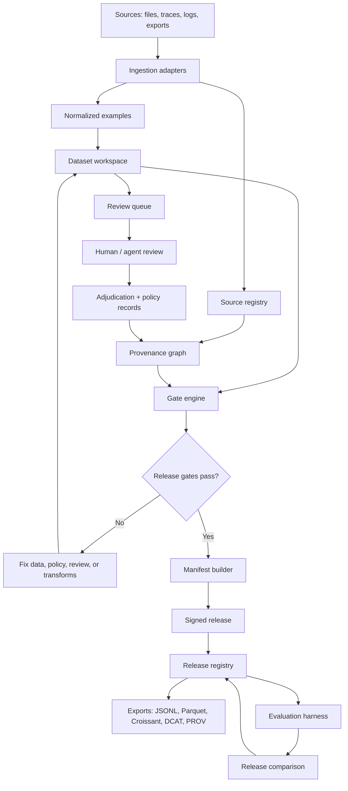
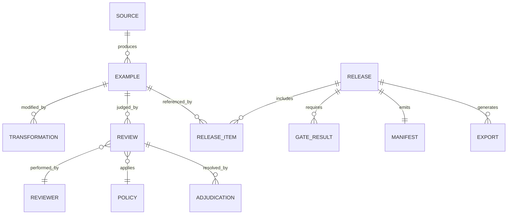

# Technical Architecture — Cadence: Sovereign Training Data Foundry

## Architecture stance

Cadence should be designed as a **local-first/private-cloud release system**, not a SaaS annotation tool. The system may sync across a team, but the default trust boundary is the owner’s environment. The product primitive is an immutable dataset release with evidence attached.

## System components

### 1. Ingestion adapters

Inputs:

- Local directories
- CSV/JSONL/Parquet files
- Git repositories
- Object stores
- Annotation exports
- Agent traces
- Design critique archives
- Support conversations
- Sensor/field logs
- Existing DVC/lakeFS pointers

Responsibilities:

- Compute content hashes.
- Capture source metadata.
- Normalize into typed examples.
- Preserve raw originals.
- Mark synthetic/model-generated inputs.
- Detect obvious duplicates and schema errors.

### 2. Dataset workspace

Mutable working area for a dataset before release.

Contains:

- Example table
- Source registry
- Transformation history
- Review queue
- Policy files
- Validation checks
- Candidate manifests

### 3. Provenance graph

A graph linking sources, examples, transformations, reviewers, policies, gates, and releases.

Potential mapping:

- PROV Entity: source file, normalized example, release manifest
- PROV Activity: ingestion, transformation, review, adjudication, export
- PROV Agent: human reviewer, agent, script, model, organization

### 4. Review and adjudication engine

Supports:

- Human review tasks
- Agent-suggested labels
- Reviewer confidence
- Disagreement capture
- Adjudication decisions
- Review-policy versioning
- Reviewer reliability metrics

Key design choice: record review as structured evidence, not just final label state.

### 5. Gate engine

Release candidates must pass configured gates.

Example gates:

- Schema validity
- Provenance completeness
- License/consent metadata completeness
- Duplicate rate threshold
- PII/sensitive-content scan
- Synthetic-data marking
- Reviewer agreement threshold
- Required expert approval
- Eval set contamination check
- Downstream evaluation delta
- Documentation completeness

### 6. Manifest builder

Generates the release artifact.

Manifest includes:

- Dataset name and version
- Content hashes
- Source summary
- Transformation summary
- Review summary
- Policy versions
- Gate results
- Intended uses
- Excluded uses
- Known limitations
- Export formats
- Signatures
- Compatibility metadata

### 7. Release registry

Immutable record of approved dataset releases.

Stores:

- Release manifest
- Release bundle pointer
- Approval chain
- Gate logs
- Comparison to previous releases
- Export history
- Revocation/deprecation records

### 8. Export layer

Possible outputs:

- JSONL/Parquet bundle
- Datasheet/Data Card markdown
- Croissant metadata
- DCAT catalog record
- PROV graph export
- OpenLineage event emission
- DVC pointer or lakeFS commit reference
- Model-training config snippet

### 9. Evaluation harness

Runs checks before and after release.

Evaluation types:

- Dataset-internal quality metrics
- Reviewer reliability metrics
- Retrieval benchmark
- Fine-tune delta test
- Regression suite
- Red-team subset probe
- Contamination/overlap check

### 10. Interface

Primary UI should be calm and evidence-oriented:

- Dataset timeline
- Release candidate checklist
- Review queue
- Provenance inspector
- Diff between releases
- Gate result panel
- Manifest preview
- Export drawer

Avoid generic dashboard sprawl. Cadence should feel like a lab instrument.

## Data flow



## Core data model



## Models

Cadence does not require a frontier model to begin.

Useful model roles:

- Embedding model for duplicate/near-duplicate detection.
- Classifier for sensitive content or policy flags.
- LLM for metadata extraction and reviewer-assist suggestions.
- Small fine-tune or retrieval system for downstream delta testing.
- Judge model for preliminary evaluation, never final truth.

Principle: any model-generated decision must be marked as model-generated and traceable to model version/prompt/config.

## Infrastructure

### MVP stack

- **App:** TypeScript web app or Python/FastAPI + lightweight frontend.
- **Local database:** SQLite for single-user prototype; Postgres for team mode.
- **Object storage:** local filesystem first; S3-compatible storage later.
- **Content addressing:** SHA-256 hashes for examples and source blobs.
- **Background jobs:** local worker queue; later Temporal or similar if workflows grow.
- **Search:** SQLite FTS or Tantivy/Lucene adapter; vector index optional.
- **Signing:** local keypair for release manifest signatures; Sigstore-style patterns later.
- **Exports:** JSON/Markdown first; Croissant/DCAT/PROV adapters next.

### Why not start with Kubernetes/MLOps stack

The hard part is not distributed compute. The hard part is the release discipline and evidence model. Early over-infrastructure would hide the core research question.

## Interfaces

### CLI

```bash
cadence init design-critique-dataset
cadence ingest ./raw --schema schemas/design_critique.yaml
cadence review assign --policy policies/v0.1.md
cadence gates run --candidate release-2026-07-18
cadence release create --version 0.1.0 --sign
cadence export --format croissant --format jsonl --format markdown
```

### API objects

- `POST /sources`
- `POST /datasets/{id}/examples`
- `POST /reviews`
- `POST /release-candidates`
- `POST /release-candidates/{id}/gates/run`
- `POST /releases/{id}/sign`
- `GET /releases/{id}/manifest`
- `GET /releases/{id}/diff/{other}`

## Storage

### Immutable storage

- Raw source blobs by content hash.
- Released example bundles by release ID.
- Signed manifests.
- Gate logs.

### Mutable storage

- Workspace examples before release.
- Review queues.
- Draft policies.
- Candidate manifests.

### Privacy design

Separate metadata visibility from raw content visibility:

- Full local/private mode: metadata and content stay together.
- Redacted manifest mode: external auditors can see hashes, counts, policy summaries, and gate outcomes without raw examples.
- Selective disclosure mode: reveal subsets under permission.

## Evaluation

### System evaluation

- Can a release be reproduced from sources and transformations?
- Can the system answer audit questions faster than manual reconstruction?
- Can a reviewer understand why an example was included?
- Can release A/B diffs explain downstream model behavior changes?

### Dataset evaluation

- Provenance completeness
- Duplicate/near-duplicate rate
- Reviewer agreement
- Policy ambiguity rate
- Sensitive-content leakage
- Eval contamination risk
- Downstream task delta
- Regression count

## Security

Threat model:

- Unauthorized access to sensitive raw data.
- Metadata leakage exposing private relationships.
- Tampered release manifest.
- Poisoned examples.
- Reviewer impersonation.
- Agent-generated labels falsely treated as human-reviewed.
- Exporting data beyond allowed use.

Controls:

- Content hashing.
- Signed manifests.
- Role-based access in team mode.
- Local encryption optional in MVP, required later.
- Audit log for review and release actions.
- Separation between raw content and redacted manifest.
- Explicit marking of synthetic/model-generated records.

## Failure modes

| Failure mode | Effect | Mitigation |
|---|---|---|
| Overly heavy workflow | Users bypass Cadence | Make release loop faster than manual export; start with narrow gates. |
| False manifest confidence | Bad data appears certified | Manifest claims process evidence, not truth; expose limitations. |
| Metadata schema bloat | Product becomes unusable | Maintain minimal core schema with adapters. |
| Reviewer disagreement hidden | Dataset quality degrades | Preserve disagreement and adjudication, not only final labels. |
| Eval overfitting | Dataset optimized to narrow benchmark | Keep holdouts, rotation, task-specific eval notes. |
| Private metadata leakage | Sensitive context exposed | Redacted manifests and selective disclosure. |
| Standards mismatch | Export adapters become brittle | Treat standards as exits; test adapters independently. |
| Agent label laundering | Synthetic decisions look human | Mandatory provenance for every decision source. |

## Dependencies

Immediate:

- SQLite/Postgres
- Filesystem/object storage
- Markdown/JSON schema generation
- Hashing/signature library
- Minimal web/CLI interface

Near-term:

- Croissant export library or generated JSON-LD
- PROV export library
- OpenLineage event ingestion
- DVC/lakeFS pointer integration
- PII/sensitive-content scanners
- Embedding model for dedupe

Later:

- Team sync
- Access control
- Key management
- Advanced evaluation pipelines
- Agentic curation plugins

## Possible stack recommendation

For a three-month prototype:

- **Backend:** Python + FastAPI for fast schema/data tooling.
- **Database:** SQLite first, Postgres-compatible schema later.
- **Frontend:** Next.js or a minimal local web UI if interaction depth matters; otherwise CLI + static manifest viewer first.
- **Data files:** JSONL/Parquet exports.
- **Schemas:** Pydantic models and JSON Schema.
- **Jobs:** simple local worker using Python tasks.
- **Signing:** Ed25519 release signatures via a small audited library.
- **Versioning:** content hashes plus release registry; integrate DVC/lakeFS later.

Reason: this keeps the prototype focused on evidence flow. The architecture can graduate to stronger infrastructure after the manifest and gate model proves useful.
