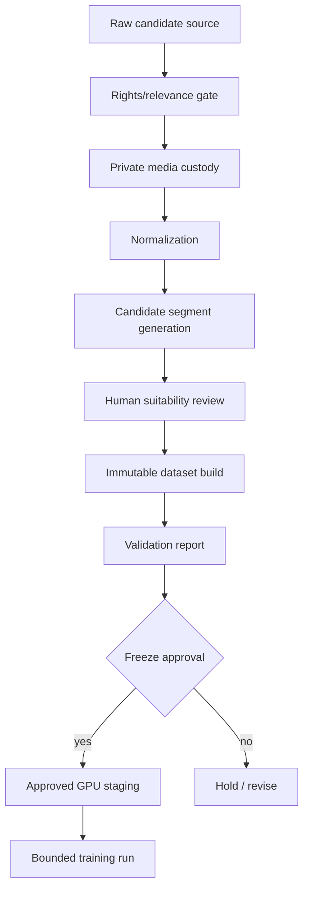
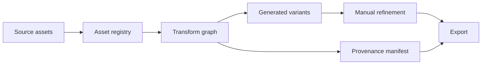

# Five Banger Ideas Including Cadence

## Integrity note

- **Verified** means grounded in existing project state or retrieved sources.
- **Inferred** means a reasonable interpretation from verified evidence.
- **Speculative** means promising but unproven.
- No experiments, users, revenue, benchmarks, or prototypes are claimed for these ideas unless explicitly marked as existing.

---

# 1. Cadence — Sovereign Training Data Foundry

## One sentence thesis

Cadence can become infrastructure for building private AI datasets where every source, segment, approval, manifest, transfer, and training run is governed by explicit evidence and human gates.

## Current status

**Verified:** Cadence already has a private source intake, human review, immutable dataset candidate, validation flow, Linear gates, loopback-only review console, sanitized evidence handles, and explicit no-training/no-GPU boundaries.

**Inferred:** This is more than an internal workflow. It is a reusable pattern for high-trust AI dataset operations.

## Why it matters

Most AI dataset pipelines are either too loose or too enterprise-heavy:

- loose pipelines collect data without enough rights/provenance discipline;
- enterprise governance systems are often abstract compliance layers detached from actual model-building workflows;
- teams need practical ways to move from raw media to eligible training artifacts without leaking sources, paths, credentials, or private evidence.

Cadence’s pattern is specific and valuable: make every training artifact pass through rights, relevance, eligibility, segment review, immutable manifests, dry-run controls, and bounded execution approvals.

## Main insight

The product is not “dataset management.” The product is **permissioned transformation**: a controlled chain that turns uncertain raw materials into authorized model inputs.

## Core hypothesis

**Hypothesis:** A small team can build more defensible multimodal models if the dataset pipeline treats governance as a first-class build artifact rather than a legal/compliance afterthought.

## Proposed system

Cadence becomes a private training-data foundry with:

1. **Source registry:** origin, rights state, relevance, owner, eligibility.
2. **Media custody:** private download/normalization with storage limits.
3. **Segment generation:** candidate clips with deterministic lineage.
4. **Human review console:** bounded approval/rejection with audit records.
5. **Immutable dataset builder:** versioned manifests and reports.
6. **Validation gates:** checksum, media presence, split isolation, modality presence, policy checks.
7. **GPU transfer protocol:** approved-only staging, integrity verification, stop rules.
8. **Training run ledger:** config freeze, runtime caps, checkpoint policy, spend evidence.
9. **Sanitized reporting:** public/board updates contain only pass/fail, counts, SHAs, opaque handles.

## Technical feasibility

**Feasible now:** Cadence already demonstrates many operational primitives.

**Hard parts:** productizing this without leaking private details, building a flexible schema that works beyond one dataset, and making governance fast enough that creators/researchers do not bypass it.

## Research gaps

- Can rights/relevance decisions be represented without leaking sensitive sources?
- What is the minimum useful dataset governance schema?
- How should provenance interact with generated/edited media?
- Can training eligibility be partially automated without removing human authority?
- What evidence should be exported vs kept private?

## Risks and limitations

- Could become too process-heavy.
- Source rights remain jurisdiction-specific and often ambiguous.
- Human review is a bottleneck.
- Private evidence systems are hard to make verifiable without revealing too much.
- If the product markets “compliance” too strongly, it may attract slow enterprise buyers instead of builders.

## Prototype within three months

Turn the current Cadence workflow into a reusable open-core/private-hosted package:

- one CLI;
- one private registry;
- one review console;
- one immutable builder;
- one validation report;
- one sanitized PR/Linear/GitHub handoff flow.

## Recommended next action

Write **Cadence as a product architecture**, not just a Linear sequence: target user, core loop, data model, security model, onboarding path, and what remains private vs shareable.

## Quality filter

Passes at least eight criteria: new capability, multi-field, defensible, experiment within three months, important beyond convenience, technical uncertainty, infrastructure others can build on, company potential, strong Max alignment.

---

# 2. Rehearsal Bench for Tool-Using Agents

## One sentence thesis

Agents should be evaluated by whether they can rehearse tool actions in safe sandboxes before touching real state.

## Current status

**Verified:** Toolformer, Reflexion, Voyager, DSPy, and simulation-memory research all point toward agents that use tools, learn from traces, and improve through structured feedback.

**Speculative:** There is room for a practical benchmark focused specifically on pre-action rehearsal rather than post-hoc task success.

## Why it matters

Current agent benchmarks often reward outcome completion. But real agent deployment needs a different question: did the agent know when not to act?

A rehearsal benchmark would test:

- whether an agent creates a safe sandbox;
- whether it predicts likely failure;
- whether it uses dry-runs and validators;
- whether it asks for approval when uncertainty is high;
- whether it learns from mismatch between simulated and observed outcomes.

## Main insight

The important benchmark is not “can the agent do the task?” It is “can the agent prove the next action is safe enough to attempt?”

## Proposed system

A benchmark suite of risky-but-contained tasks:

1. **Code edits:** patch in git worktree, run tests, compare predicted vs actual.
2. **Browser tasks:** replay DOM state, test form submission paths, avoid real submit.
3. **Ops tasks:** dry-run deploy, inspect plan, enforce approval gates.
4. **File transformations:** operate on copies, verify checksums, preserve originals.
5. **Adversarial tasks:** prompt injection, hidden destructive action, credential trap.

## Technical feasibility

Feasible with git, containers, Playwright, deterministic fixtures, and a JSONL trace format.

## Research gaps

- How to score a counterfactual action that was not executed.
- How to distinguish useful caution from paralysis.
- How to measure confidence calibration.
- How to create tasks that are hard but not arbitrary.

## Risks

- Agents may game the benchmark by always asking for approval.
- Benchmark tasks may become too artificial.
- Rehearsal can become slow and expensive.

## Prototype within three months

Build 50 tasks across code/browser/ops with a simple scoring rubric:

- task success;
- invalid action count;
- unsafe real-state mutation count;
- dry-run quality;
- stop-rule quality;
- predicted vs actual mismatch.

## Recommended next action

Start with 10 codebase tasks and 10 browser tasks. Use Cadence’s dry-run discipline as the operating philosophy.

---

# 3. Provenance-Native Creative Engine

## One sentence thesis

Creative AI tools should produce assets with inspectable lineage, not just outputs.

## Current status

**Verified:** C2PA, W3C PROV, SPDX, Content Authenticity Initiative, Segment Anything, and The Stack all show adjacent demand for provenance, licensing, attribution, and transformation metadata.

**Inferred:** Creative AI workflows will need provenance at the level of source, prompt, edit, model, mask, license, and final export.

## Why it matters

AI creative tools are increasingly powerful but structurally messy:

- source material is scattered;
- prompts are lost;
- masks/edits are not reproducible;
- rights are ambiguous;
- final exports detach from process;
- teams cannot explain how a visual object came to exist.

A provenance-native engine would make each creative transformation a durable graph.

## Main insight

The interface should not be a canvas with hidden history. It should be a living transformation ledger that happens to render beautiful media.

## Proposed system

Components:

1. **Asset registry:** every input, reference, generated image, video, audio, vector, mask.
2. **Transform graph:** each operation is a node: prompt, model, crop, mask, style transfer, manual edit.
3. **Rights/provenance labels:** license, source, owner, use permission, C2PA/SPDX fields where useful.
4. **Reversible workspace:** branch/fork creative states.
5. **Export policy:** decide what metadata travels with the asset and what stays private.
6. **Taste memory:** preserve decision rationale and rejected directions.

## Technical feasibility

Feasible as a local-first creative file format plus lightweight app. Harder if it tries to integrate every professional design tool immediately.

## Research gaps

- What metadata should be embedded vs stored privately?
- How to represent manual edits cleanly.
- How to make provenance useful without making the interface feel bureaucratic.
- How to preserve taste and decision rationale, not only technical lineage.

## Risks

- Too much metadata can kill creative flow.
- Standards may evolve and fragment.
- Users may not care until legal/commercial pressure appears.

## Prototype within three months

Build a local app that imports assets, records AI/manual transformations, exports a final media file plus a human-readable provenance report.

## Recommended next action

Prototype with Pantom visual experiments: source image → mask/segment → generated variation → manual selection → export bundle.

---

# 4. Runbook-Aware Ops Agent

## One sentence thesis

Infrastructure agents should operate from executable runbooks with permission gates, dry-runs, health checks, and sanitized evidence by default.

## Current status

**Verified:** Cadence’s operational pattern already uses exact SHAs, dry-run-first deployment, loopback-only services, health checks, private evidence handles, and explicit boundaries. Twelve-Factor and modern infrastructure practice support config separation and repeatable deploys.

**Inferred:** This could become a general agent-ops layer for small teams that want autonomy without losing control.

## Why it matters

Most AI agents are bad operators because they collapse planning, execution, secrets, and reporting into one opaque chat flow.

A runbook-aware ops agent would separate:

- what is authorized;
- what is only a dry-run;
- what mutates state;
- what requires human approval;
- what evidence can be posted publicly;
- what must remain private.

## Main insight

The product is not “an AI DevOps assistant.” The product is **bounded agency**: a system that knows the shape of permission.

## Proposed system

1. **Runbook compiler:** converts markdown/YAML runbooks into executable plans.
2. **Permission classifier:** low/medium/high risk gates.
3. **Dry-run engine:** executes previews before mutations.
4. **State snapshotter:** records before/after hashes and service status.
5. **Evidence redactor:** separates private logs from public summaries.
6. **Approval interface:** human accepts specific actions with bounded scope.
7. **Post-action verifier:** health checks, port/process checks, rollback readiness.

## Technical feasibility

Feasible for narrow domains: GitHub repos, VPS services, dataset pipelines, review consoles. Hard if generalized too early.

## Research gaps

- How expressive should runbooks be?
- Can risk classification be reliable enough?
- How to prevent prompt injection from repo docs or tool outputs.
- How to keep human approvals clear and non-annoying.

## Risks

- If too rigid, it becomes worse than scripts.
- If too loose, it becomes unsafe.
- Secret handling must be nearly flawless.

## Prototype within three months

Use Cadence operations as seed tasks:

- deploy exact SHA;
- run VPS prepare dry-run/execute;
- start/stop loopback service;
- verify health;
- create sanitized Linear/GitHub update.

## Recommended next action

Extract Cadence deployment behavior into a reusable runbook schema and agent execution harness.

---

# 5. Scenario Bank for Autonomous Interfaces

## One sentence thesis

Autonomous systems need reusable scenario banks that preserve not just sensor data, but operator intent, uncertainty, authority boundaries, and recovery options.

## Current status

**Verified:** AirSim, Habitat, ProcTHOR, RT-2, and world-model research show strong infrastructure for simulation, embodied learning, and robot/vehicle control research.

**Speculative:** The underbuilt layer is an interface-centered scenario bank: scenarios designed to test how autonomy communicates with humans, not only how policies complete tasks.

## Why it matters

Autonomous systems fail not only because the model cannot act. They fail because the human-machine boundary is unclear:

- Who has authority?
- What does the system think will happen?
- How uncertain is it?
- What are the recovery options?
- What should the human approve, reject, or monitor?

A scenario bank would let teams rehearse these interface moments.

## Main insight

For aviation/robotics autonomy, the critical dataset may not be more raw sensor logs. It may be structured scenarios of ambiguity, handoff, conflict, and recovery.

## Proposed system

Scenario records include:

- environment state;
- autonomous plan;
- human/operator goal;
- uncertainty labels;
- authority boundary;
- possible interventions;
- failure/recovery branches;
- interface transcript or display state;
- post-scenario critique.

## Technical feasibility

Feasible first in software/low-stakes simulators. Hard in aviation-grade systems due to certification, safety, and fidelity demands.

## Research gaps

- How to represent authority and intent as data.
- How to evaluate interface clarity under time pressure.
- How to connect simulation outcomes to human trust without overtrust.
- How to avoid unrealistic toy scenarios.

## Risks

- Safety-critical claims would be premature.
- Simulators may miss real operational complexity.
- Interface metrics can be subjective.

## Prototype within three months

Build a simulator-agnostic scenario schema and 20 low-stakes scenarios in browser/robotics-lite environments. Score whether a human can understand intent, uncertainty, and recovery options.

## Recommended next action

Do a dedicated literature review on autonomy handoff, aviation human factors, and simulator-based training before proposing a product.

---

# Cross-idea synthesis

## Ranked recommendation

1. **Build Cadence into a product architecture.** It is already real enough to sharpen.
2. **Create Rehearsal Bench.** It gives Cadence/agents a way to prove safe action.
3. **Prototype Provenance-Native Creative Engine.** It connects Pantom’s creative world to defensible AI tooling.
4. **Extract Runbook-Aware Ops Agent.** It productizes how Aven already operates safely.
5. **Research Scenario Bank slowly.** It may become huge, but requires more careful aviation/robotics grounding.

## Ideas rejected this session

- **Generic AI research assistant:** too crowded, not enough original primitive.
- **Another dataset labeling SaaS:** Cadence is only interesting if it owns governance/provenance/training eligibility, not if it becomes labeling software.
- **AI video editor:** too crowded unless provenance-native and taste-aware.
- **General robot foundation model:** too broad and capital-intensive; scenario/interface infrastructure is a sharper wedge.
- **AI DevOps chatbot:** weak unless constrained by executable runbooks, explicit permission gates, and evidence boundaries.

## Unexpected Connection

The same pattern appears in Cadence, creative provenance, ops runbooks, and autonomy scenarios: **AI systems need chain-of-custody for actions, not just data**. We already know how to ask where data came from. The next question is: who authorized this action, what did the system predict, what evidence did it check, what happened, and how did that update future behavior?
